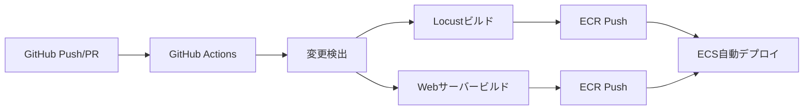

# GitHub Actions CI/CD設計 - Locust on AWS

## 概要

このドキュメントでは、LocustとWebサーバーのコンテナイメージをビルドし、Amazon ECRにプッシュするためのGitHub Actions CI/CDパイプラインの設計について説明します。

## 目標

1. **自動化**: コードプッシュ時の自動ビルド・プッシュ
2. **効率性**: 変更されたイメージのみビルド・プッシュ
3. **セキュリティ**: IAMロール、OIDC認証の活用
4. **並列実行**: LocustとWebサーバーのビルドを並列実行
5. **キャッシュ活用**: Dockerビルドキャッシュによる高速化

## アーキテクチャ概要



## ワークフロー設計

### トリガー条件

1. **プッシュイベント**:
   - `main`ブランチへのプッシュ
   - タグプッシュ（`v*`）
   
2. **プルリクエスト**:
   - イメージビルドテストのみ（プッシュなし）

3. **手動実行**:
   - `workflow_dispatch`による手動トリガー

### ジョブ構成

#### 1. 変更検出ジョブ (`detect-changes`)
- **目的**: 変更されたアプリケーションを検出
- **出力**: 
  - `locust-changed`: Locustアプリの変更有無
  - `webserver-changed`: Webサーバーアプリの変更有無

#### 2. Locustビルドジョブ (`build-locust`)
- **条件**: `locust-changed == 'true'`
- **処理**:
  - ECRログイン
  - Dockerイメージビルド
  - ECRプッシュ
  - イメージタグ管理

#### 3. Webサーバービルドジョブ (`build-webserver`)
- **条件**: `webserver-changed == 'true'`
- **処理**:
  - ECRログイン
  - Dockerイメージビルド（マルチステージ）
  - ECRプッシュ
  - イメージタグ管理

## セキュリティ設計

### OIDC認証
```yaml
permissions:
  id-token: write
  contents: read
```

### IAMロール設定
- **ロール名**: `locust-fargate-cicd-ecr-role`
- **信頼ポリシー**: GitHub Actions OIDC プロバイダー
- **権限**: ECRプッシュ権限のみ

### シークレット管理
- **AWS_REGION**: AWSリージョン（Repository Secret）
- **AWS_ACCOUNT_ID**: AWSアカウントID（Repository Secret）

## タグ戦略

### 自動タグ生成
1. **latest**: mainブランチの最新コミット
2. **commit-{SHA}**: GitコミットハッシュベースのタグAL
3. **pr-{NUMBER}**: プルリクエスト用タグ
4. **v{VERSION}**: リリースタグ（手動タグ作成時）

### タグ使用例
```
123456789012.dkr.ecr.ap-northeast-1.amazonaws.com/locust-fargate-locust-custom:latest
123456789012.dkr.ecr.ap-northeast-1.amazonaws.com/locust-fargate-locust-custom:commit-abc123
123456789012.dkr.ecr.ap-northeast-1.amazonaws.com/locust-fargate-test-webserver:v1.0.0
```

## ビルド最適化

### Dockerビルドキャッシュ
- GitHub Actions cache を使用
- レイヤーキャッシュによる高速化

### 並列実行
- LocustとWebサーバーのビルドを並列実行
- 変更されたアプリケーションのみビルド

## ファイル構成

```
.github/
└── workflows/
    ├── build-images.yml          # メインワークフロー
    └── pr-build-check.yml        # PRビルドチェック用
```

## 環境変数とシークレット

### Repository Secrets
```yaml
AWS_REGION: ap-northeast-1
AWS_ACCOUNT_ID: 123456789012
```

### 環境変数
```yaml
ECR_REGISTRY: ${AWS_ACCOUNT_ID}.dkr.ecr.${AWS_REGION}.amazonaws.com
LOCUST_REPOSITORY: ${ECR_REGISTRY}/locust-fargate-locust-custom
WEBSERVER_REPOSITORY: ${ECR_REGISTRY}/locust-fargate-test-webserver
```

## ワークフロー詳細設計

### メインワークフロー (`build-images.yml`)

```yaml
name: Build and Push Docker Images

on:
  push:
    branches: [main]
    tags: ['v*']
  pull_request:
    branches: [main]
  workflow_dispatch:

env:
  AWS_REGION: ${{ secrets.AWS_REGION }}
  AWS_ACCOUNT_ID: ${{ secrets.AWS_ACCOUNT_ID }}
  ECR_REGISTRY: ${{ secrets.AWS_ACCOUNT_ID }}.dkr.ecr.${{ secrets.AWS_REGION }}.amazonaws.com

jobs:
  detect-changes:
    # 変更検出ロジック
  
  build-locust:
    # Locustイメージビルド
    
  build-webserver:
    # Webサーバーイメージビルド
```

## エラーハンドリング

### 失敗時の対応
1. **ビルド失敗**: 詳細ログの出力
2. **プッシュ失敗**: リトライ機能
3. **権限エラー**: IAMロール設定の確認ガイド

### 通知設定
- **成功**: Slackチャンネルへの通知（オプション）
- **失敗**: 担当者へのメール通知（オプション）

## モニタリング

### メトリクス
- ビルド時間の追跡
- 成功/失敗率の監視
- ECRストレージ使用量の監視

### ログ
- 詳細なビルドログの保存
- エラー時のデバッグ情報

## デプロイメント統合

### ECSサービス更新
現在は手動更新ですが、将来的には以下を検討：

1. **自動ECSサービス更新**
2. **カナリアデプロイメント**
3. **ブルーグリーンデプロイメント**

## 運用考慮事項

### コスト最適化
- 不要なビルドの回避（変更検出）
- ECRライフサイクルポリシーの活用
- スポットインスタンスの使用（長時間ビルド時）

### セキュリティ
- 定期的なベースイメージの更新
- 脆弱性スキャンの自動実行
- シークレットローテーション

## 実装ステップ

### Phase 1: 基本ワークフロー
1. GitHub Actionsワークフローファイルの作成
2. IAMロールとOIDC設定
3. 基本的なビルド・プッシュ機能

### Phase 2: 最適化
1. 変更検出機能の実装
2. ビルドキャッシュの最適化
3. 並列実行の実装

### Phase 3: 高度な機能
1. 自動ECSデプロイメント
2. 通知機能
3. モニタリングダッシュボード

## 制限事項

1. **GitHub Actions制限**: 月間実行時間の制限
2. **ECRストレージ**: イメージサイズとコスト
3. **ネットワーク**: ビルド時間への影響

この設計により、効率的で安全なCI/CDパイプラインを構築し、継続的なデプロイメントを実現できます。
