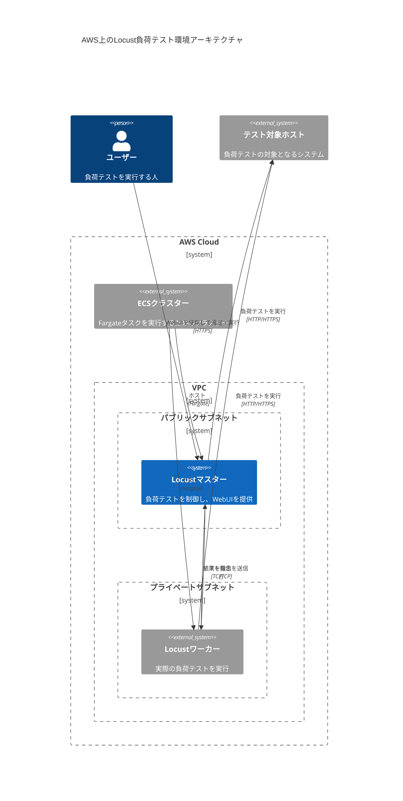

# AWS ECS上のLocust負荷テスト環境

このリポジトリはTerraformを使用して、AWS ECS上にLocust負荷テスト環境を構築するためのコードを提供します。Amazon ECRによるプライベートコンテナレジストリ管理機能とGitHub Actions CI/CD自動化付きです。

## プロジェクト構造

```
locust-on-aws/
├── .github/                 # GitHub Actions ワークフロー
│   └── workflows/
│       ├── build-images.yml     # メインビルド・プッシュワークフロー
│       └── pr-build-check.yml   # PR用ビルドチェック
├── apps/                    # アプリケーションディレクトリ
│   ├── locust/              # Locustテスト関連
│   │   ├── Dockerfile       # Locustのカスタムイメージ用
│   │   ├── locustfile.py    # 負荷テストスクリプト
│   │   └── requirements.txt # 依存関係
│   └── webserver/           # テスト対象Webサーバー
│       ├── Dockerfile       # Webサーバーのカスタムイメージ用（TypeScript版）
│       ├── server.ts        # サンプルWebアプリ（TypeScript版）
│       ├── package.json     # 依存関係
│       └── tsconfig.json    # TypeScript設定
├── scripts/                 # 自動化スクリプト
│   └── build-and-push-images.sh # ECRイメージビルド・プッシュスクリプト（ローカル開発用）
├── terraform/               # インフラ定義
│   └── modules/
│       ├── ecr/             # ECRリポジトリ管理
│       ├── network/         # ネットワーク関連
│       ├── ecs_cluster/     # ECSクラスター
│       ├── locust_master/   # Locustマスターノード
│       ├── locust_worker/   # Locustワーカーノード
│       └── test_webserver/  # テスト対象Webサーバー
├── CI_DESIGN.md            # GitHub Actions CI/CD設計ドキュメント
├── GITHUB_ACTIONS_SETUP.md # GitHub Actions セットアップガイド
└── ECR_DESIGN.md           # ECR統合設計ドキュメント
```

## 構成

このプロジェクトは以下のAWSリソースを作成します：

- **ネットワーク**: VPC、サブネット、セキュリティグループ、ロードバランサー
- **コンテナレジストリ**: Amazon ECRプライベートリポジトリ（webserver、locust用）
- **コンテナ基盤**: ECSクラスター、Fargateタスク
- **Locust環境**: マスターノード（WebUI）、ワーカーノード（負荷生成）
- **テスト対象**: TypeScript Webサーバー（オートスケーリング対応）

## クイックスタート

### 1. 前提条件
- AWS CLI設定済み
- Docker Desktop/Engine稼働中
- Terraform >= 1.5

### 2. コンテナイメージのビルド・プッシュ
```bash
# ECRリポジトリの作成とイメージのプッシュ
./scripts/build-and-push-images.sh
```

### 3. インフラストラクチャのデプロイ
```bash
cd terraform
terraform init
terraform plan
terraform apply
```

### 4. 負荷テストの実行
```bash
# Terraform出力からLocust WebUIのURLを取得
terraform output locust_web_ui_url

# ブラウザでLocust WebUIにアクセスして負荷テストを開始
```

## CI/CD自動化

### GitHub Actions による自動化

このプロジェクトはGitHub Actionsを使用した自動CI/CDパイプラインを提供しています：

#### 自動機能
- **コード変更検出**: アプリケーションコードの変更を自動検出
- **並列ビルド**: LocustとWebサーバーイメージの並列ビルド
- **自動プッシュ**: ECRへの自動イメージプッシュ
- **セキュリティスキャン**: イメージの脆弱性スキャン
- **PR チェック**: プルリクエスト時のビルド検証

#### セットアップ

詳細なセットアップ手順は [GITHUB_ACTIONS_SETUP.md](./GITHUB_ACTIONS_SETUP.md) を参照してください。

1. **AWS OIDC設定**:
   ```bash
   aws iam create-open-id-connect-provider \
     --url https://token.actions.githubusercontent.com \
     --client-id-list sts.amazonaws.com \
     --thumbprint-list 6938fd4d98bab03faadb97b34396831e3780aea1
   ```

2. **GitHub Secrets設定**:
   - `AWS_REGION`: `ap-northeast-1`
   - `AWS_ACCOUNT_ID`: あなたのAWSアカウントID

3. **自動ビルド有効化**:
   - mainブランチへのプッシュで自動実行
   - アプリケーションコード変更時のみビルド
   - 手動実行も可能

#### ワークフロー

```yaml
# メインワークフロー: .github/workflows/build-images.yml
# - 変更検出
# - 並列ビルド・プッシュ
# - セキュリティスキャン

# PRチェック: .github/workflows/pr-build-check.yml  
# - Dockerfileの検証
# - ビルドテスト
```

### ローカル開発

GitHub Actionsに加えて、ローカル開発用のスクリプトも利用できます：

```bash
# 全イメージをビルド・プッシュ
./scripts/build-and-push-images.sh

# 特定イメージのみビルド
./scripts/build-and-push-images.sh --locust-only
./scripts/build-and-push-images.sh --webserver-only

# 強制ビルド（変更検出をスキップ）
./scripts/build-and-push-images.sh --force
```

## 使用方法

1. AWSの認証情報を設定します
2. Terraformの初期化を行います：`terraform init`
3. 実行計画を確認します：`terraform plan`
4. インフラストラクチャをデプロイします：`terraform apply`

## 変数

主な変数は`variables.tf`ファイルで定義されています。必要に応じて変更してください。

## 注意事項

- このプロジェクトはデモンストレーション目的で作成されています。本番環境で使用する場合は、セキュリティ設定などを適切に見直してください。
- 負荷テスト実行中はAWSリソースの使用料が発生します。テスト完了後は`terraform destroy`でリソースを削除することをお勧めします。

## diagram 

