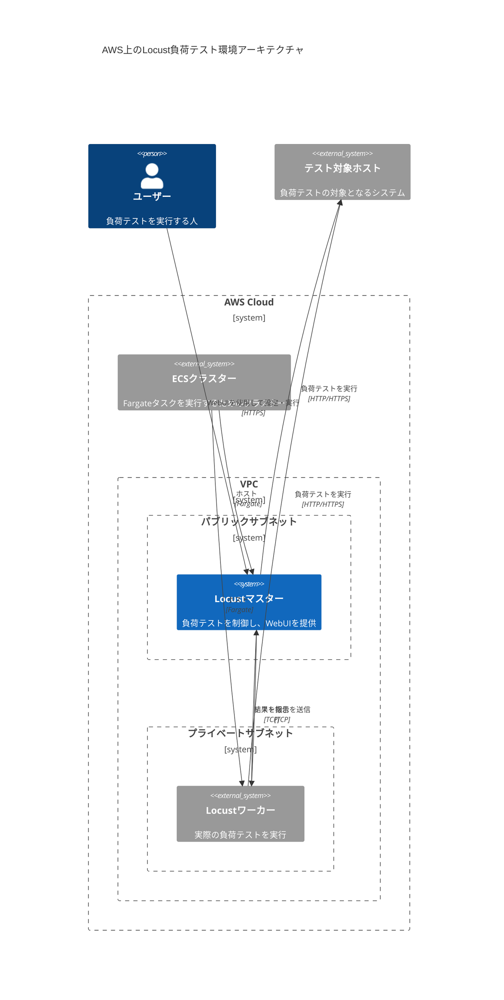

# AWS ECS上のLocust負荷テスト環境

このリポジトリはTerraformを使用して、AWS ECS上にLocust負荷テスト環境を構築するためのコードを提供します。Amazon ECRによるプライベートコンテナレジストリ管理機能付きです。

## プロジェクト構造

```
locust-on-aws/
├── apps/                    # アプリケーションディレクトリ
│   ├── locust/              # Locustテスト関連
│   │   ├── Dockerfile       # Locustのカスタムイメージ用
│   │   ├── locustfile.py    # 負荷テストスクリプト
│   │   └── requirements.txt # 依存関係
│   └── webserver/           # テスト対象Webサーバー
│       ├── Dockerfile       # Webサーバーのカスタムイメージ用（TypeScript版）
│       ├── server.ts        # サンプルWebアプリ（TypeScript版）
│       ├── package.json     # 依存関係
│       └── tsconfig.json    # TypeScript設定
├── scripts/                 # 自動化スクリプト
│   └── build-and-push-images.sh # ECRイメージビルド・プッシュスクリプト
└── terraform/               # インフラ定義
    └── modules/
        ├── ecr/             # ECRリポジトリ管理
        ├── network/         # ネットワーク関連
        ├── ecs_cluster/     # ECSクラスター
        ├── locust_master/   # Locustマスターノード
        ├── locust_worker/   # Locustワーカーノード
        └── test_webserver/  # テスト対象Webサーバー
```

## 構成

このプロジェクトは以下のAWSリソースを作成します：

- **ネットワーク**: VPC、サブネット、セキュリティグループ、ロードバランサー
- **コンテナレジストリ**: Amazon ECRプライベートリポジトリ（webserver、locust用）
- **コンテナ基盤**: ECSクラスター、Fargateタスク
- **Locust環境**: マスターノード（WebUI）、ワーカーノード（負荷生成）
- **テスト対象**: TypeScript Webサーバー（オートスケーリング対応）

## クイックスタート

### 1. 前提条件
- AWS CLI設定済み
- Docker Desktop/Engine稼働中
- Terraform >= 1.5

### 2. コンテナイメージのビルド・プッシュ
```bash
# ECRリポジトリの作成とイメージのプッシュ
./scripts/build-and-push-images.sh
```

### 3. インフラストラクチャのデプロイ
```bash
cd terraform
terraform init
terraform plan
terraform apply
```

### 4. 負荷テストの実行
```bash
# Terraform出力からLocust WebUIのURLを取得
terraform output locust_web_ui_url

# ブラウザでLocust WebUIにアクセスして負荷テストを開始
```

## 使用方法

1. AWSの認証情報を設定します
2. Terraformの初期化を行います：`terraform init`
3. 実行計画を確認します：`terraform plan`
4. インフラストラクチャをデプロイします：`terraform apply`

## 変数

主な変数は`variables.tf`ファイルで定義されています。必要に応じて変更してください。

## 注意事項

- このプロジェクトはデモンストレーション目的で作成されています。本番環境で使用する場合は、セキュリティ設定などを適切に見直してください。
- 負荷テスト実行中はAWSリソースの使用料が発生します。テスト完了後は`terraform destroy`でリソースを削除することをお勧めします。

## diagram 


```mermaid
C4Context
    title AWS上のLocust負荷テスト環境アーキテクチャ

    Person(user, "ユーザー", "負荷テストを実行する人")
    
    Boundary(aws, "AWS Cloud") {
        Boundary(vpc, "VPC") {
            Boundary(public_subnet, "パブリックサブネット") {
                System(locust_master, "Locustマスター", "負荷テストを制御し、WebUIを提供")
            }
            
            Boundary(private_subnet, "プライベートサブネット") {
                System_Ext(locust_workers, "Locustワーカー", "実際の負荷テストを実行")
            }
        }
        
        System_Ext(ecs_cluster, "ECSクラスター", "Fargateタスクを実行するためのクラスター")
    }
    
    System_Ext(target_host, "テスト対象ホスト", "負荷テストの対象となるシステム")

    Rel(user, locust_master, "WebUIを使用して設定・実行", "HTTPS")
    Rel(locust_master, locust_workers, "テスト指示を送信", "TCP")
    Rel(locust_workers, locust_master, "結果を報告", "TCP")
    Rel(locust_master, target_host, "負荷テストを実行", "HTTP/HTTPS")
    Rel(locust_workers, target_host, "負荷テストを実行", "HTTP/HTTPS")
    Rel(ecs_cluster, locust_master, "ホスト", "Fargate")
    Rel(ecs_cluster, locust_workers, "ホスト", "Fargate")

    UpdateLayoutConfig($c4ShapeInRow="3", $c4BoundaryInRow="1")
```